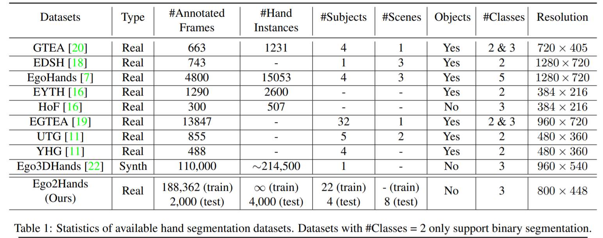

## Segmentation models inference times

- Tested on Intel(R) Core(TM) i7-9750H CPU @ 2.60GHz

| Model                           | Frames per second |
| --------------------------------| ------------------|
| UNet                            |      3.65         |
| UNet1/8                         |      54.45        |
| SegNet                          |      3.35         |
| ModSegNet                       |      10.43        |
| RefineNet                       |      1.08         |
| LightWeightRefineNet            |      1.67         |
| ICNet                           |      3.90         |

## Hand Segmentation Datasets 

<b> Table summarizing important info about the prominent datasets </b>

| Name         | No. of hands  | No. of frames | View     | Dataset link | Paper link | 
|--------------|---------------|---------------|----------|-------------------|-------|
| Ego2Hands | 2 | 188,362 | Egocentric | [Dataset](https://github.com/AlextheEngineer/Ego2Hands) | [Paper](https://arxiv.org/abs/2011.07252) |
| EgoHands | 1-4 | 4,800 | Egocentric | [Dataset](http://vision.soic.indiana.edu/projects/egohands/) | [Paper](https://openaccess.thecvf.com/content_iccv_2015/html/Bambach_Lending_A_Hand_ICCV_2015_paper.html) |
| EGTEA | 1-2 (1 in most frames) | 13,847 | Egocentric | [Dataset](http://cbs.ic.gatech.edu/fpv/) | [Paper](https://arxiv.org/abs/2006.00626) |
| EgoYouTubeHands | 1-2 | 1,290 | Egocentric | [Dataset](https://github.com/aurooj/Hand-Segmentation-in-the-Wild) | [Paper](https://arxiv.org/abs/1803.03317) |
| HandOverFace | 1-2 | 300 | Third-person | [Dataset](https://github.com/aurooj/Hand-Segmentation-in-the-Wild) | [Paper](https://arxiv.org/abs/1803.03317) |

<b> Table extensively comparing all hand segmentation datasets </b>  
- From the Ego2Hands paper

